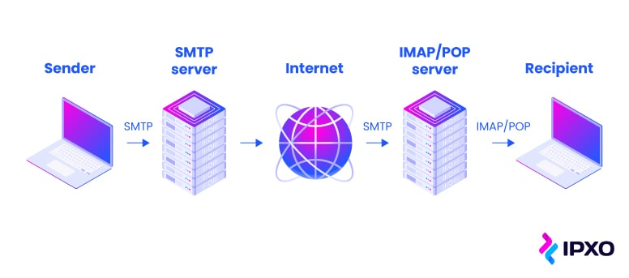

[](https://www.python.org/)
[](https://www.djangoproject.com/start/)
[](https://developer.mozilla.org/en-US/docs/Web/HTML)
[](https://developer.mozilla.org/en-US/docs/Web/CSS)

**[TodoApp](http://todoapp-nazar2022.pythonanywhere.com/) is a notebook for your daily tasks.**

### Used Web Services 

- [Pythonanywhere](https://www.pythonanywhere.com/) as a hosting service.
- [Mailgun](https://www.mailgun.com/) as a smtp server for testing porpuses with simple API integration for the most popular programming languges.
- Google SMTP server and third-party application for sending emails.

### How works SMTP



#

The following diagram illustrates the flow that allows a user to reset the password using an email address.


### Core functionality
- User registration and login.
- **CRUD** operations for user profile entities.
- **CRUD** operations for task entities.
- Dynamic **JavaScript** real time calendar.
- Password recovery functionality via **django** buit-in class-based views.
- Test automations.


### Installation
In the beginning ensure you have installed [Python](https://www.python.org/downloads/), [pip](https://pip.pypa.io/en/stable/installation/), [Node](https://nodejs.org/en) and [npm](https://www.npmjs.com/)  on your system.

```
git clone https://github.com/Nazar-Pichak/TodoApp.git
```

- create virtual environment in the project root folder

```
python -m venv .venv
```
- activate environment

1. Windows
```
.venv\Scripts\activate
```

2. Linux/MacOS

```
source .venv/bin/activate
```

- install dependencies and run the app

```
python -m pip install --upgrade pip
pip install -r requirements.txt
npm install
cd todo_list
python manage.py runserver
```

- if there were any changes or improvements to the app, run the tests as well

```
cd todo_list
python manage.py test
```

- also run command for compressing and optimizing **css** file for deployment

```
npm run build:css
```
